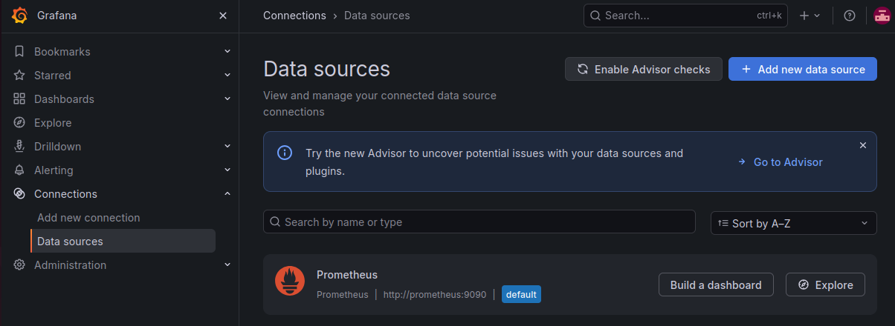
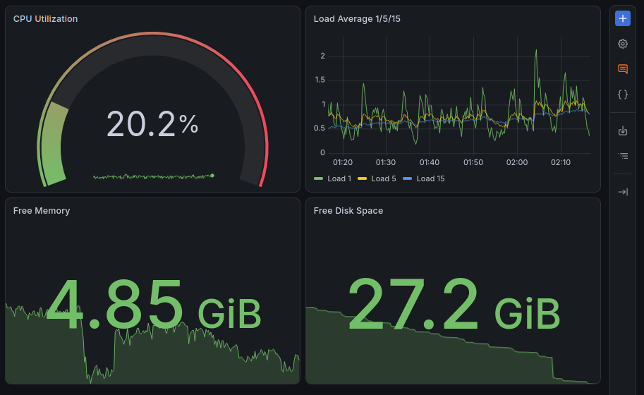
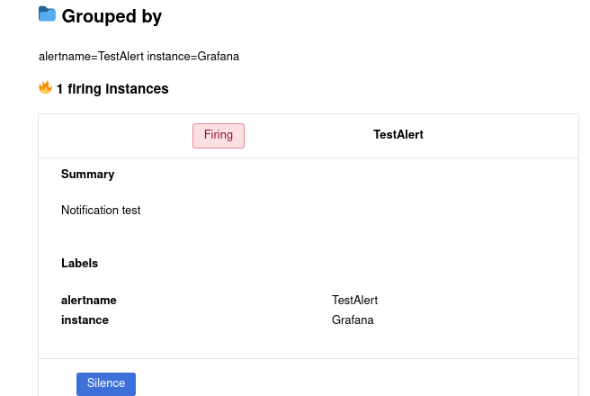
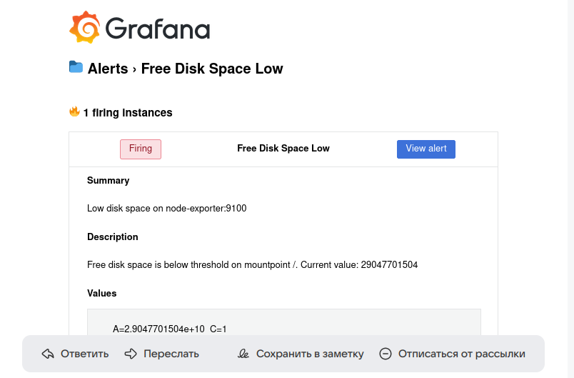
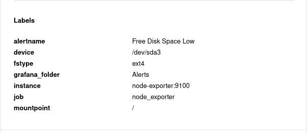

# Домашнее задание к занятию «Средство визуализации Grafana»
Выполнил: Береснев Игорь Андреевич

---

Задание 1

1. Используя директорию help внутри этого домашнего задания, запустите связку prometheus-grafana.

2. Зайдите в веб-интерфейс grafana, используя авторизационные данные, указанные в манифесте docker-compose.

3. Подключите поднятый вами prometheus, как источник данных.

4. Решение домашнего задания — скриншот веб-интерфейса grafana со списком подключенных Datasource.

### Скриншот веб-интерфейса grafana

Задание 2

Создайте Dashboard и в ней создайте Panels:

- утилизация CPU для nodeexporter (в процентах, 100-idle);
- CPULA 1/5/15;
- количество свободной оперативной памяти;
- количество места на файловой системе.

### Скриншот dashboard

Задание 3

1. Создайте для каждой Dashboard подходящее правило alert — можно обратиться к первой лекции в блоке «Мониторинг».
2. В качестве решения задания приведите скриншот вашей итоговой Dashboard.

Задание 4

1. Сохраните ваш Dashboard.Для этого перейдите в настройки Dashboard, выберите в боковом меню «JSON MODEL». Далее скопируйте отображаемое json-содержимое в отдельный файл и сохраните его.
2. В качестве решения задания приведите листинг этого файла.

### Скриншот тестового сообщения

Теперь посмотрите изменения в файле README.md, выполнив команды git diff и git diff --staged.

### Скриншот уведомления о срабатывании

